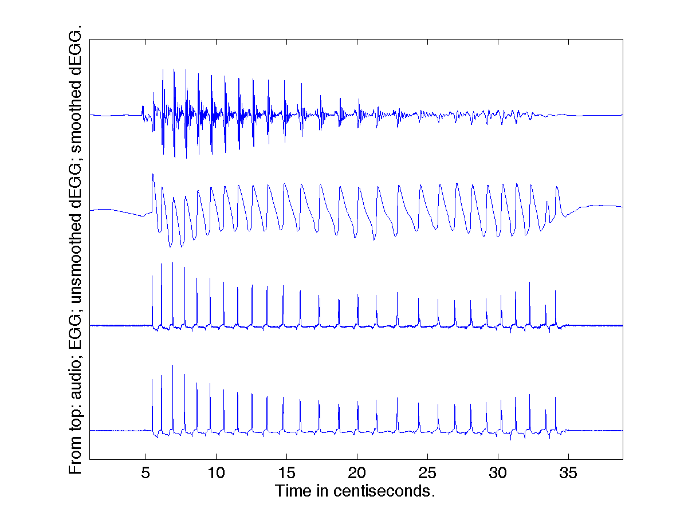
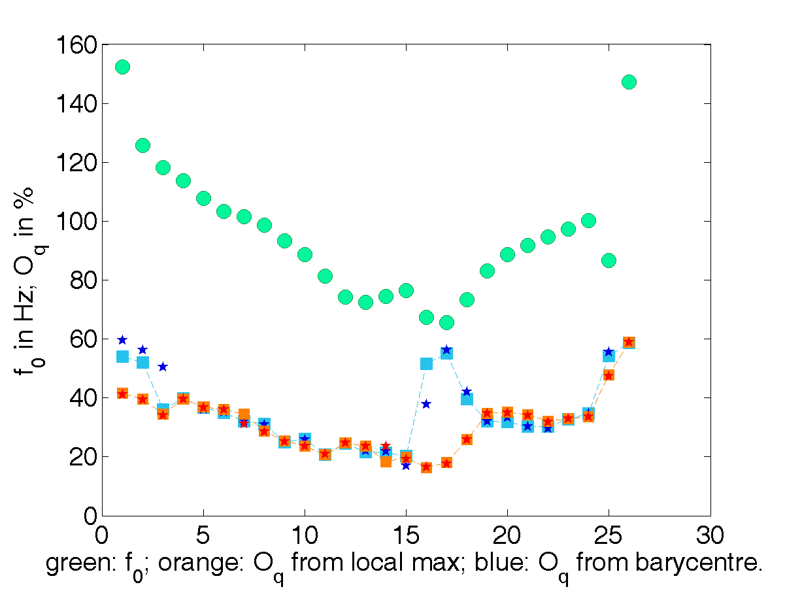

Gallery of electroglottographic signals
=============

The diversity of electroglottographic signals is impressive. States of the glottis can change rapidly: signals for the same speaker are highly diverse. There is diversity across phonological categories, diversity among speaking styles, diversity along the lifespan, and of course there are differences across speakers. 

The gallery presented here aims to provide a basis for a classification of phonation types. The idea is to identify some _types_, and relate them to the various classifications proposed in the literature. Emphasis is laid on quantified criteria, which allow for the automatic detection of these types. This is expected to facilitate discussion of phonation types among phoneticians. 

The work is now (2019) in its initial stage, with _glottalization_ as a first area of investigation.

## Types of glottalization: glottal constriction, creaky voice/vocal fry, irregular phonation...

> The term “creaky voice” (or “creak”, used here
> interchangeably) refers to a number of different
> kinds of voice production. (Keating et al. 2015)

### 1. Constricted creak

The first example is _constricted creak_. You can download the signals from the **gallery** folder: [audio](1_ConstrictedCreak_M1_AUD.wav) and [electroglottographic signal](1_ConstrictedCreak_M1_EGG.wav).

Analysis of the signal with peakdet yields the following results (which you can load into Matlab from the 1.mat file). The x axis represents _glottal cycles_, which constitute data points in the results file.

Fundamental frequency (show as green dots on the figure) is low. The electroglottographic signal looks quasi-periodic (no noticeable jumps in duration from one cycle to the next), but measurements of f0 bring out slight irregularities (jitter) as f0 it reaches its lowest point, at glottal cycles 15 to 20. Those cycles are also a point where open quotient values (which are very low throughout this token) are harder to estimate: this is evidenced by the gap between the values in orange (calculated by simply detecting the local minimum in the EGG signal) and in blue (which take into account the shape of the signal, detecting multiple peaks and calculating their barycentre).

## References
Keating, Patricia, Marc Garellek & Jody Kreiman. 2015. Acoustic properties of different kinds of creaky voice. Proceedings of the 18th International Congress of Phonetic Sciences. Glasgow.

