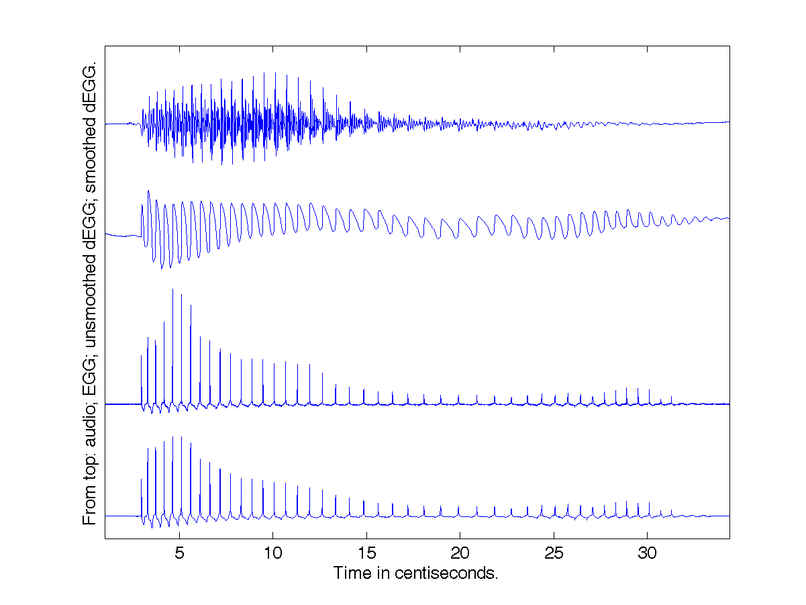
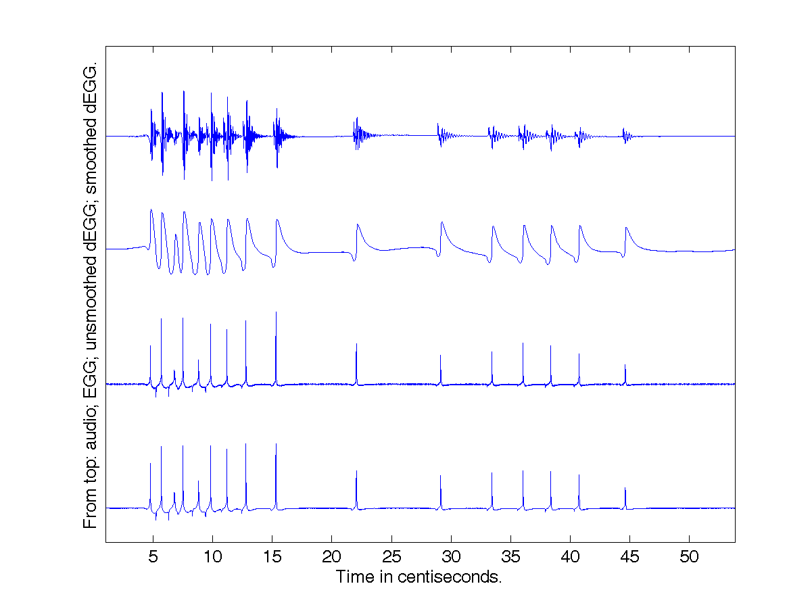
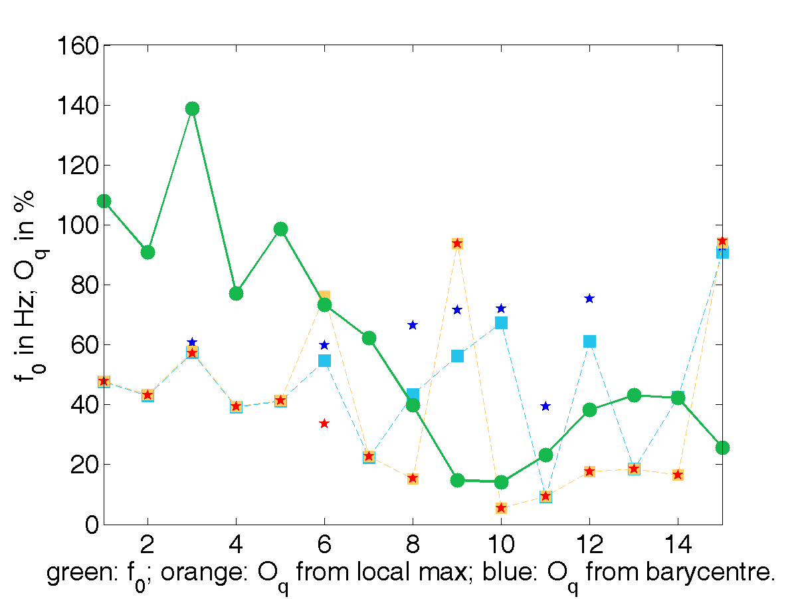

Gallery of electroglottographic signals [work in progress]
=============

The diversity of electroglottographic signals is impressive. States of the glottis can change rapidly: signals for the same speaker are highly diverse. There is diversity across phonological categories, diversity among speaking styles, diversity along the lifespan, and of course there are differences across speakers. 

The gallery presented here aims to provide a basis for a classification of phonation types. The idea is to identify some _types_, and relate them to the various classifications proposed in the literature. Emphasis is laid on quantified criteria, which allow for the automatic detection of these types. This is expected to facilitate discussion of phonation types among phoneticians. 

The work is now (2019) in its initial stage, with _glottalization_ as a first area of investigation.

## Types of glottalization: glottal constriction, creaky voice/vocal fry, irregular phonation...

Glottalized signals are often pooled together into _one_ phonation type, variously referred to as 'creaky voice', 'vocal fry', or 'glottalized voicing'. Thus, in their typology of phonation mechanisms, Roubeau, Henrich & Castellengo (2009) acknowledge the diversity of the various modes of vibration associated with lowest fundamental frequency ("a periodic glottal cycle, with
a very low frequency, or nonperiodic-impulsions, or multiple
cycles (doubles and triples)", p. 431)
but nonetheless group them under the same heading: "phonation mechanism zero" (M0), as distinguished from the two phonation mechanisms mostly used in operratic singing, M1 (corresponding roughly to "chest voice") and M2 ("head voice").

The approach chosen here consists in testing to what extent phonetic subtypes can be reliably characterized, and distinguished on the basis of electroglottographic signals.

> The term “creaky voice” (or “creak”, used here
> interchangeably) refers to a number of different
> kinds of voice production. (Keating et al. 2015)

### 1. Constricted creak

The first example is _constricted creak_. The signals can be downloaded from the **gallery** folder: [audio](1_ConstrictedCreak_M1_AUD.wav) and [electroglottographic signal](1_ConstrictedCreak_M1_EGG.wav). You can also download the figures as vector drawings (in PDF format) from the **images** folder.

On the audio signal, there are hints of creak: longer pulses, of much smaller amplitude, in the second half as compared to the first.

Analysis of the EGG signal with `peakdet` yields the results shown in the figure below. (The data can be loaded into Matlab from the `1.mat` file). The x axis represents _glottal cycles_, which constitute data points in the results file.

Fundamental frequency (show as green dots on the figure) is low. The electroglottographic signal looks quasi-periodic (no noticeable jumps in duration from one cycle to the next), but measurements of f0 bring out slight irregularities (jitter) as f0 it reaches its lowest point, at glottal cycles 15 to 20. Those cycles are also a point where open quotient values (which are very low throughout this token) are harder to estimate: this is evidenced by the gap between the estimates in orange and in blue. The values in orange are calculated by simply detecting the local minimum in the EGG signal; those in blue take into account the shape of the signal (multiple peaks are detected, and a barycentre is calculated). In this token, the opening peaks in the derivative of the electroglottographic signal are so inconspicuous that it comes as a surprise that the orange line should not be discontinuous. 

Overall, this signal exemplifies voicing _on the verge of aperiodicity_. Phonation enters into phonation mechanism zero (_bona fide_ creak), compromising periodicity without losing it altogether.

A similar example from a female speaker (F13) is shown below. It is a token of the same word, /paj⁴/. 

Like in the token by speaker M1 (above), f0 is still essentially continuous. The open quotient can be assessed with precision: it is extremely low (remembering that for female speakers, as a general rule Oq is higher than for men). 

### 2. Extremely low-frequency single-pulse creak

Example 2 (the same word as in example 1, by another speaker) is similar to example 1 in important respects: (i) cycles are long and consist of a single pulse (as opposed to the double-pulsed or multiple-pulsed patterns which will be described below); (ii) the auditory impression is one of constriction, rather than relaxed phonation; and (iii) cycle length increases again after reaching the lowest values (i.e. glottalization does not interrupt voicing). 

But examples 1 and 2 differ in no less important respects, as brought out in the analysis results below. 

First, periodicity is lost. (The inverse of cycle duration is nonetheless still referred to as ' f0' for convenience.) Five or six cycles of 'jittery' f0 are followed by rock-bottom values (below 40 Hz). 

Moreover, the opening peaks on the dEGG signal, which were still (just barely) clear enough in example 1 to allow for confident evaluation of the glottal open quotient, are so inconspicuous in example 2 that they tend to become indetectable, hence the disagreement between the values shown in blue and orange. It is not unreasonable, in view of the shape of the EGG signal, to consider that these cycles have an extremely short open phase, and the lowest Oq values (those in orange, correcting for two outliers at the 9th and 15th cycles) provide good estimates: Oq is on the order of just 20% (i.e. **rock-bottom values**, like for f0) for the longest cycles.

Overall, example 2 can be described as more extreme than example 1: a clear lapse into creaky voice, with the lowest possible f0 and Oq, but still with a single pulse per cycle. Phonation is almost arrested by the strong constriction, and only continues 'pulse by pulse' as puffs of air find their way through the closed sphincter. 

## Summary in table form

example | label | materials | f0 range | periodicity | n° of pulses | Oq |
------- | ----------- | ----------- | ----------- | ----------- |------- |------- |
1 | constricted creak | /paj⁴/, speaker M1 | very low | almost quasi-periodic | 1 | very low  |
2 | extremely low, single-pulse creak | /paj⁴/, speaker M11 | bottom | aperiodic | 1 | bottom, and hard to measure from the EGG signal |

## References
- Keating, Patricia, Marc Garellek & Jody Kreiman. 2015. Acoustic properties of different kinds of creaky voice. _Proceedings of the 18th International Congress of Phonetic Sciences_. Glasgow.
- Roubeau, Bernard, Nathalie Henrich & Michèle Castellengo. 2009. Laryngeal vibratory mechanisms: the notion of vocal register revisited. _Journal of Voice_ 23(4). 425–38.

