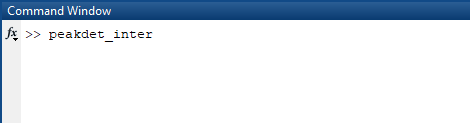

How to use `peakdet_inter`: a step-by-step guide _(work in progress)_
=============

`peakdet_inter` is a version of `peakdet` with interface for user verification. Here is how to use it. 

## Preparation work
You need two input files: the EGG recording in WAV format, and a text file (.txt) containing the boundaries of the portions of signal to be analyzed.

The example signal, `M11_disyll_EGG.wav`, is shown in the figure below, together with the corresponding audio (`M11_disyll_AUD.wav`). This is a recording of the compound noun /la⁴ tɔŋ²/ (language: Muong): /la⁴/ means 'leaf', and /tɔŋ²/ refers to a type of plant, _Stachyphrynium placentarium_. With a view to studying tone, the boundaries are set so as to exclude voiced initial consonants, such as /l/. If the focus of study were different (e.g. studying consonants, or any other topic), then the boundaries would be placed according to the study's objectives, of course.

These regions are then exported from SoundForge to a plain text file: in this case, `M11_disyll_REGIONS.txt`. 

## Running the script
Set the `Matlab` path to the folder that contains `peakdet_inter.m`

To start the script, type `peakdet_inter` in the Command window:

Next, you are prompted to select an EGG recording. Select the example file, `M11_disyll_EGG.wav`, located in the `HOWTO` folder.

The second input file required contains the boundaries of the portions of signal to be analyzed.
It can be 
- either a text file produced by exporting a list of regions from the SoundForge audio editing software, in which case the script retrieves the information 
- or a text file containing simply the beginning and end times (in seconds). Note that, in that case, the file needs to be encoded as ANSI.
The example files, `M11_disyll_REGIONS.txt` and `M11_disyll_REGIONS_PlainTxt.txt`, contain just two regions. 

