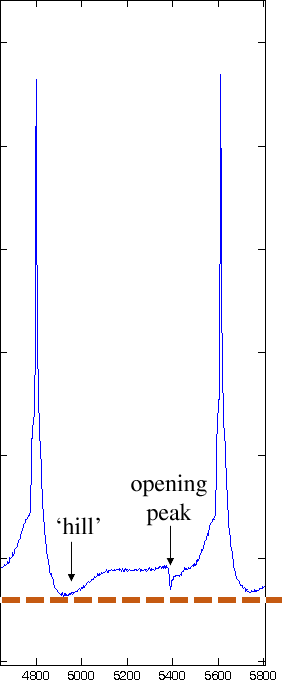
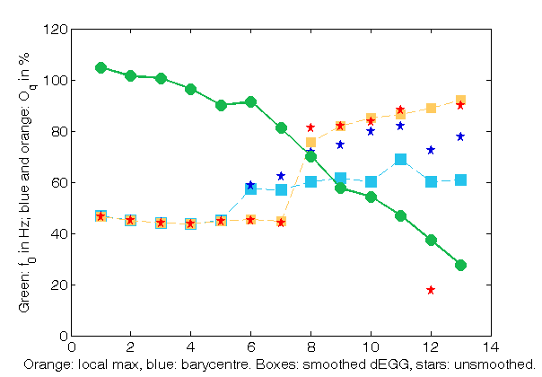
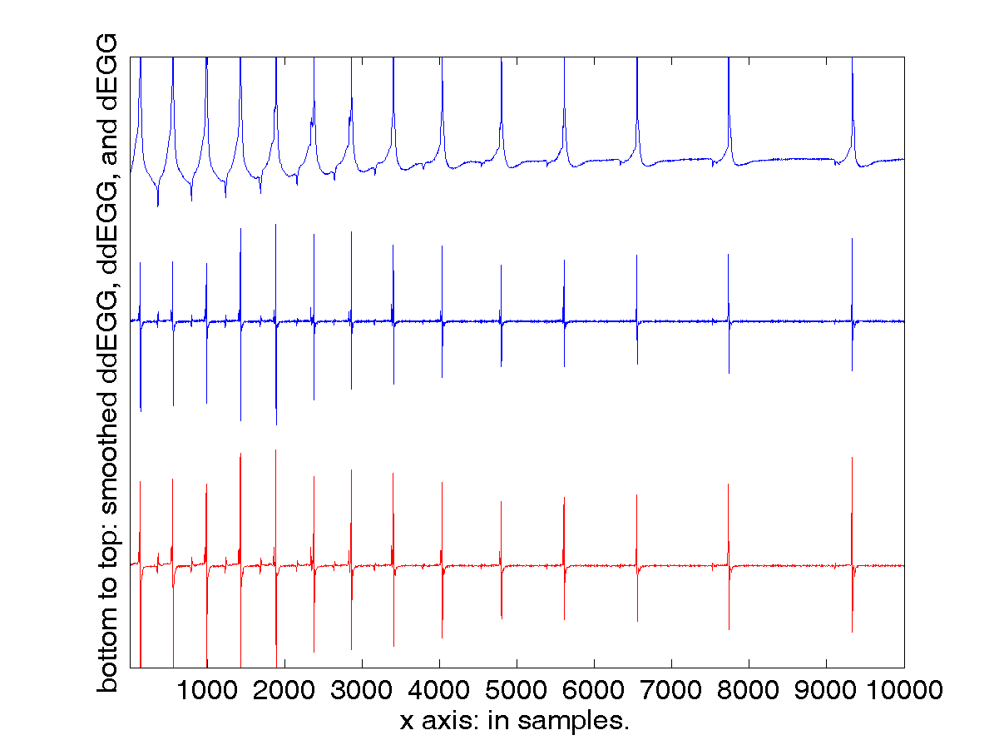

peakdet_inter: a version of `peakdet` with interface for user verification
=============

`peakdet` is a script for the semi-automatic analysis of the electroglottographic (EGG) signal.

A version of `peakdet` is hosted [in the COVAREP repository](https://github.com/covarep/covarep/tree/master/glottalsource/egg/peakdet). Following
COVAREP's principles, that version is written as a function taking a
signal as input, without a user interface. 
 
The present version, by contrast, takes as input a list of regions to analyze
and incorporates a (simple) display for verification of the results by the user. 
This script is called `peakdet_inter`, where 'inter' stands for 'interface'.

The back-end is also being improved, in order to handle better the great diversity of electroglottographic signals. 

## 1. Peaks vs. hills: detecting opening peaks inside glottalized pulses
The first challenge tackled in the current (2019) development consists in detecting an opening peak that does not constitute a local minimum in the derivative of the EGG signal (dEGG). 

This is especially common inside glottalized pulses, characterized by extremely low f_0. Consider the example below (EGG file: `M11_disyll_EGG.wav`; audio file: `M11_disyll_AUD.wav`). 

This is clearly an instance of glottalized voicing: the amplitude of the audio and EGG signals decreases in the course of the syllable, and f_0 decreases. So it is a safe guess that the glottal open quotient is low. Examining the derivative of the EGG signal, an opening peak can be discerned: see the glottal cycle zoomed in below. But this opening peak, with its telltale needle-like shape, does not constitute the lowest point in the portion of dEGG signal between two glottal closures: near the beginning of the cycle, there is a trough in the signal (like an inverted hill) during which the signal reaches a lower value than during the opening peak.

Methods for the detection of opening peaks implemented in version 1 of `peakdet` cannot handle such cases properly, because they use the local minimum in the dEGG signal as a landmark. Starting from the 8th cycle (when glottalization becomes strong), O_q values do not make sense: the values computed from the local minimum (in orange) are high, misleadingly estimating that the 'hill' at beginning of cycle reflects glottis opening; values based on a barycentre constitute a no less misleading average across peaks which, from a physiological point of view, are incompatible.

In order to detect the opening peak, the difference in shape between the 'hill' and the 'needle' needs to be taken into account. This is not just an issue of dealing with high-frequency noise (small dents in the signal), but of excluding the 'hill' altogether. 

The method chosen consists in computing the second derivative of the EGG signal. This derivative brings out changes in the dEGG signal's slope: since the 'needle' has a steeper slope than the 'hill', the derivative of the dEGG signal (hereafter ddEGG) is likely to have a noticeable 'pulse' corresponding to the needle-shaped dEGG signal. 

Since the second derivative is even noisier than the first, smoothing needs to be applied (using the same convolution as for filtering the dEGG signal). Tests with Savitzky-Golay filtering (3rd-order polynomial over window of 7 points: the Matlab command is simply `sgolayfilt(ddEGG,3,7)`) are somewhat less conclusive than with a simple linearly weighted symmetric moving average. The figure below shows (i) the first derivative of the EGG signal (dEGG; top), (ii) the second derivative (ddEGG; middle), and (iii) the ddEGG signal after smoothing (in red).

Comparing dEGG and ddEGG, it looks as if there were no gain in terms of salience of the opening peak: opening peaks even seem harder to make out on the ddEGG signal (even after smoothing) than on the dEGG signal. The first six opening peaks are perfectly clear from the dEGG signal, whereas only the first four are really salient from the ddEGG signal before smoothing. Later peaks are even harder to guess. But looking at the second derivative more closely, there is nonetheless some promise in this method, because it achieves the goal of smoothing out the 'hills' in the dEGG signal.
